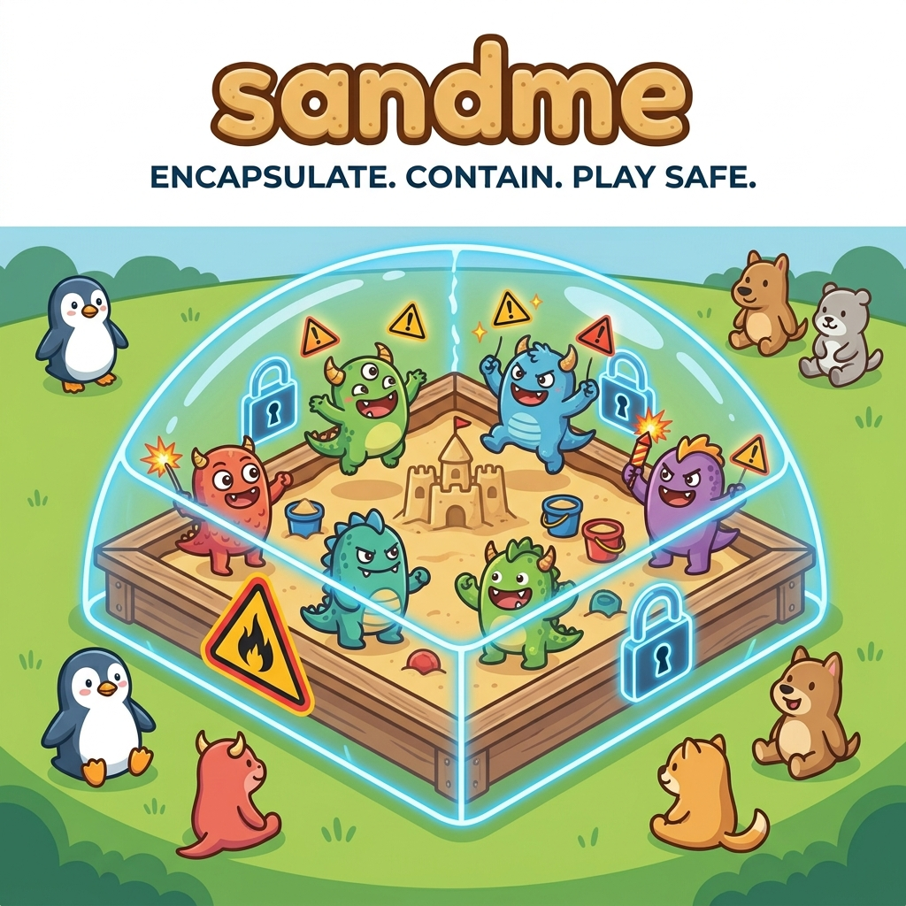

<p align="center">
  
</p>

# sandme

[](https://github.com/leopepe/sandme/releases)

`sandme` runs a command — your IDE, your coding agent, or anything else — inside a kernel sandbox,
with its network egress routed through a proxy `sandme` starts and stops alongside it. On macOS the
sandbox is
[Seatbelt](https://developer.apple.com/library/archive/documentation/Darwin/Reference/ManPages/man7/sandbox.7.html),
applied by `sandbox-exec`. On Linux it is
[Landlock](https://docs.kernel.org/userspace-api/landlock.html), which the command applies to
itself just before it execs.

Everything is denied by default. The command gets read+write access to the paths you share, and
one network destination: the proxy. Child processes inherit the same sandbox, so an agent that
shells out cannot step outside it.

`sandme`'s lifetime is the command's lifetime — no daemon, nothing left running.

## Features

- **Filesystem confinement.** The command reads and writes only the paths you name. The default is
  the directory you run in — `~/.ssh` and `~/.aws` are not exposed.
- **One route out.** All egress goes through a proxy `sandme` owns. Everything else is denied:
  direct HTTP, DNS, raw sockets, listening sockets.
- **A proxy that refuses your own network.** Loopback, RFC1918, link-local — including the cloud
  metadata address — are rejected, so the sandbox is not undone by the route out of it.
- **Per-run credentials.** Each invocation's proxy requires a secret published only to the command
  it wrapped; any other local process gets `407`.
- **Inherited by children.** An agent that shells out, and everything that shell starts, stays
  inside the same sandbox.
- **Read-only toolchain paths.** Share a Homebrew or Nix prefix as runnable but not writable.
- **A no-network mode.** `proxy = false` runs the command with no way out at all.
- **App-bundle aware.** A macOS IDE launched through its CLI wrapper is redirected to the bundle's
  own executable, which the sandbox can actually run.
- **No daemon.** One process, one lifetime, nothing left behind.

## Requirements

| Platform | Needs |
| --- | --- |
| macOS | `sandbox-exec`, present on every supported macOS |
| Linux | Kernel 6.7 or newer, with Landlock enabled |

Kernel 6.7 is Landlock ABI v4, the first version that can restrict outbound TCP by port. Below
that `sandme` refuses to start rather than confine the filesystem and leave egress open. Landlock
reaches the filesystem and outbound TCP; UDP and raw sockets stay outside it.

## Install

**A release binary.** Every tagged release publishes a tarball per target —
`aarch64-apple-darwin`, `x86_64-unknown-linux-gnu`, `aarch64-unknown-linux-gnu` — with a matching
`.sha256`, on the [releases page](https://github.com/leopepe/sandme/releases):

```shell
shasum -a 256 -c sandme-v0.1.0-aarch64-apple-darwin.tar.gz.sha256
tar xzf sandme-v0.1.0-aarch64-apple-darwin.tar.gz
cp sandme-v0.1.0-aarch64-apple-darwin/sandme /usr/local/bin/
```

The binaries are not signed or notarised. On macOS a downloaded tarball carries a quarantine
attribute, and Gatekeeper refuses the binary — the dialog says macOS cannot check it for malicious
software, which reads like a broken tool and is not one. Clear the attribute once:

```shell
xattr -d com.apple.quarantine /usr/local/bin/sandme
```

**From source.**

```shell
cargo build --release
cp target/release/sandme /usr/local/bin/
```

## Usage

```
sandme <command> [args...]
```

There are two forms, and the difference matters.

**Multiple operands — direct exec.** The first word is the program, the rest are its arguments,
passed through unshelled and unquoted. No shell is involved.

```shell
sandme ls -la ~/Workspace
sandme cargo test
```

**A single quoted operand — routed through `/bin/bash -c`.** Use this when you want shell features:
pipes, redirection, globbing, `&&`, variable expansion, and process substitution.

```shell
sandme 'ls -la ~/Workspace | grep rust'
sandme 'cargo build 2>&1 | tee build.log'
```

Use `--` when the command has its own options that would otherwise be read as `sandme`'s:

```shell
sandme -- curl -sS https://example.com/
```

Running an editor or a coding agent takes two more settings — a share that covers the tool's own
state, and `gui_mode` for its caches and scratch space:

```shell
SANDME_GUI_MODE=1 SANDME_SHARED_PATHS="$HOME,/opt/homebrew" sandme claude
SANDME_GUI_MODE=1 SANDME_SHARED_PATHS="$HOME,/opt/homebrew" sandme zed ~/Workspace/my-project
```

[`examples/`](examples/) has worked invocations for agents, editors and toolchains.

`sandme` follows the exec-wrapper convention of `env(1)` and `timeout(1)`, so a script can tell a
failure of `sandme`'s from a failure of the command it wrapped —
[`docs/reference/exit-status.md`](docs/reference/exit-status.md) has the table.

## Configuration

`sandme` reads `~/.sandme/config.toml`. Every key has a matching environment variable, and the
environment always wins. No config file is required — without one you get the defaults.

| Key | Environment variable | Default | What it does |
| --- | --- | --- | --- |
| `shared_paths` | `SANDME_SHARED_PATHS` | the current working directory | Paths the command may read **and write** |
| `read_only_paths` | `SANDME_READ_ONLY_PATHS` | empty | Paths the command may read and execute but not write |
| `proxy` | `SANDME_PROXY` | `true` | Whether to start the egress proxy; `false` means no network at all |
| `proxy_port` | `SANDME_PROXY_PORT` | `0` | Proxy's loopback port; `0` picks a free one, so parallel runs never collide |
| `gui_mode` | `SANDME_GUI_MODE` | `false` | Also grants the per-user state and scratch directories that editors and agents need |
| `allow_private_egress` | `SANDME_ALLOW_PRIVATE_EGRESS` | `false` | Lets the proxy reach your own machine and LAN — needed for a local model server |

```toml
# ~/.sandme/config.toml
shared_paths = ["~/Workspace"]
read_only_paths = ["/opt/homebrew"]
gui_mode = true
```

Types, defaults in full, the caveats behind each key, and a longer starting config are in
[`docs/reference/configuration.md`](docs/reference/configuration.md); a commented file to copy is
in [`examples/config.toml`](examples/config.toml).

## Documentation

| | |
| --- | --- |
| [What the sandbox allows](docs/reference/sandbox-model.md) | Every grant on macOS and Linux, what is denied outright, and how egress is confined |
| [Configuration](docs/reference/configuration.md) | Every key, its type, its default and its caveats |
| [Exit status](docs/reference/exit-status.md) | How to tell a `sandme` failure from the command's own |
| [Known limitations](docs/reference/limitations.md) | The gaps that are real and open — read before trusting the sandbox with something hostile |
| [`examples/`](examples/) | Worked invocations for agents, editors and toolchains |

## Contributing

[`CONTRIBUTING.md`](CONTRIBUTING.md) covers building, testing, the quality gate and the review a
sandbox change needs. `AGENTS.md` is the working agreement; `docs/specs/` holds the requirements,
`docs/adrs/` the structural decisions, and `docs/guidelines/` the rules that apply across changes.

Found a way *out* of the sandbox? Do not open an issue — see [`SECURITY.md`](SECURITY.md).
